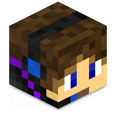
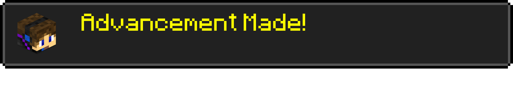
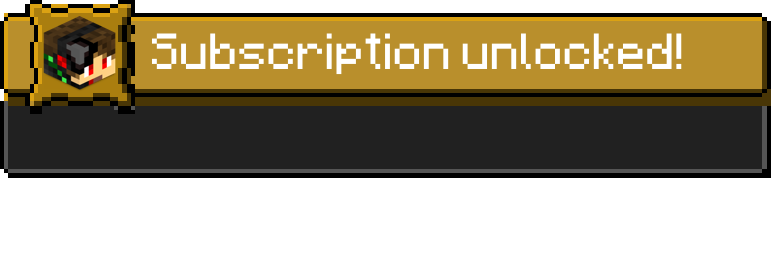
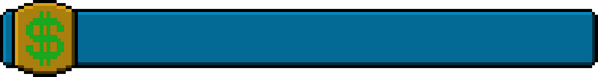
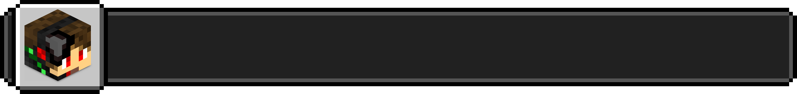
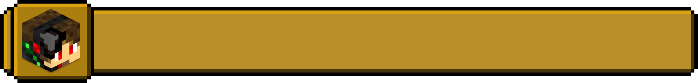

[![Contributors][contributors-shield]][contributors-url]
[![Forks][forks-shield]][forks-url]
[![Stargazers][stars-shield]][stars-url]
[![Issues][issues-shield]][issues-url]
[![MIT License][license-shield]][license-url]
[![LinkedIn][linkedin-shield]][linkedin-url]

<!-- PROJECT LOGO -->
 

  

  <h3 align="center">ScorchAlertBox Twitch Bot</h3>

  

    Twitch Clip Bot
     
    <a href="https://github.com/ScorchChamp/ScorchAlertBox/releases/">Releases »</a>
     
     
    <a href="https://github.com/ScorchChamp/ScorchAlertBox">View Demo</a>
    ·
    <a href="https://github.com/ScorchChamp/ScorchAlertBox/issues">Report Bug</a>
    ·
    <a href="https://github.com/ScorchChamp/ScorchAlertBox/issues">Request Feature</a>
  

## Files

If you want to change the images, please use the same size!

### ALERT ITEMS
> ./images/alert_follower.png -> Overlay for follower alert

> ./images/alert_subscriber.png -> Overlay for subscriber alert

> ./css/Followers.css -> CSS file for follower alert

> ./css/Subscriptions.css -> CSS file for Subscription alert

### LIST ITEMS
> ./images/list_donation.png -> Overlay for donation list

> ./images/list_follower.png -> Overlay for follower list

> ./images/list_subsciber.png -> Overlay for subscriber list

<!-- CONTACT -->
## Contact

ScorchChamp - scorchchamp@gmail.com

Project Link: [https://github.com/ScorchChamp/ScorchAlertBox](https://github.com/ScorchChamp/ScorchAlertBox)

[contributors-shield]: https://img.shields.io/github/contributors/ScorchChamp/ScorchAlertBox.svg?style=for-the-badge
[contributors-url]: https://github.com/ScorchChamp/ScorchAlertBox/graphs/contributors
[forks-shield]: https://img.shields.io/github/forks/ScorchChamp/ScorchAlertBox.svg?style=for-the-badge
[forks-url]: https://github.com/ScorchChamp/ScorchAlertBox/network/members
[stars-shield]: https://img.shields.io/github/stars/ScorchChamp/ScorchAlertBox.svg?style=for-the-badge
[stars-url]: https://github.com/ScorchChamp/ScorchAlertBox/stargazers
[issues-shield]: https://img.shields.io/github/issues/ScorchChamp/ScorchAlertBox.svg?style=for-the-badge
[issues-url]: https://github.com/ScorchChamp/ScorchAlertBox/issues
[license-shield]: https://img.shields.io/github/license/ScorchChamp/ScorchAlertBox.svg?style=for-the-badge
[license-url]: https://github.com/ScorchChamp/ScorchAlertBox/blob/master/LICENSE.txt
[linkedin-shield]: https://img.shields.io/badge/-LinkedIn-black.svg?style=for-the-badge&logo=linkedin&colorB=555
[linkedin-url]: https://www.linkedin.com/in/lars-cornelissen-56504520b/
[youtube-url]: https://www.youtube.com/c/scorchai